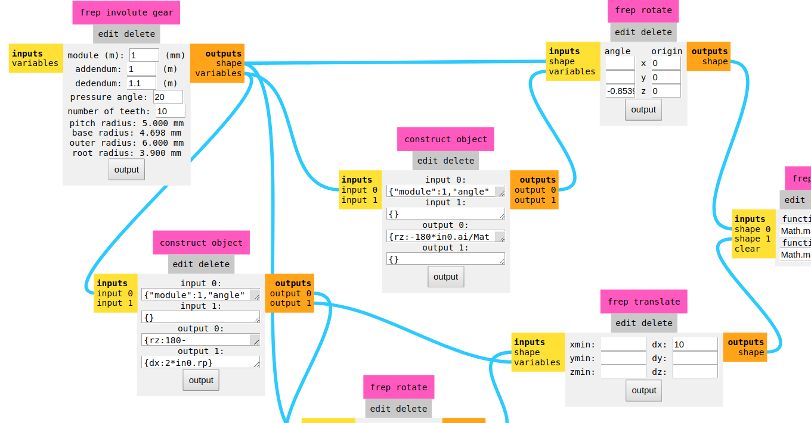

# `mods` Community Edition

Just like `mods`, but cooler :sunglasses:

<!-- vim-markdown-toc GFM -->

* [What is `mods`?](#what-is-mods)
* [Current status](#current-status)
* [Documentation and tutorials](#documentation-and-tutorials)
	* [Linux & MacOS & Windows WSL/WSL2](#linux--macos--windows-wslwsl2)
		* [Installation](#installation)
		* [Using `mods`](#using-mods)
	* [Windows Powershell](#windows-powershell)

<!-- vim-markdown-toc -->

## What is `mods`?

`mods` community edition is a fork of [CBA mods research project](https://gitlab.cba.mit.edu/pub/mods). `mods` is a modular cross platform tool for fablabs. It is based on independent but interrelated modules. `mods` could potentially be used for CAD, CAM, machine control, automation, building UI, read input devices, react to to physical models, and much more. The possibilies are endless.

The goal of the community edition is to provide documentation, support and help the community engage in the project and foster the development/exchange of new modules.

## Current status

- Linux Maintaners: Fran, s-ol, Sibu, Nicolas et al.
- Mac Maintaner: Fran (help wanted!)
- Windows Maintaner: Adrian Torres, Liu Shawn

|                 | Windows Powershell | Windows 10 WSL Ubuntu 20.04 LTS | MacOS           | Ubuntu 20 LTS | Arch Linux |
|-----------------|--------------------|---------------------------------|-----------------|---------------|------------|
| Installation    | PASS               | PASS                            | PASS            | PASS          | PASS       |
| Running         | PASS               | PASS                            | PASS            | PASS          | PASS       |
| Moving machines | SERIAL, PRINTER    | SERIAL, PRINTER                 | SERIAL, PRINTER | ALL           | ALL        |

## Documentation and tutorials

Check out the [wiki](https://gitlab.fabcloud.org/pub/project/mods/-/wikis/home) for more guides and tutorials.

### Linux & MacOS & Windows WSL/WSL2

#### Installation

- Step 1: Clone the `mods` repository: `git clone https://gitlab.fabcloud.org/pub/project/mods.git`
- Step 2: Run the installation script `bash install-mods` inside the `mods` folder

Logout or reboot for the permission changes to take effect.

#### Using `mods`

- Run `bash mods` in a terminal inside the `mods` directory. It will open a web browser with mods in it and start a the servers required to operate the machines.

### Windows Powershell

- Not recommended. It requires manual installation and manual start of all servers. Follow the documentation on the [wiki](https://gitlab.fabcloud.org/pub/project/mods/-/wikis/Windows-Powershell). (WIP).
